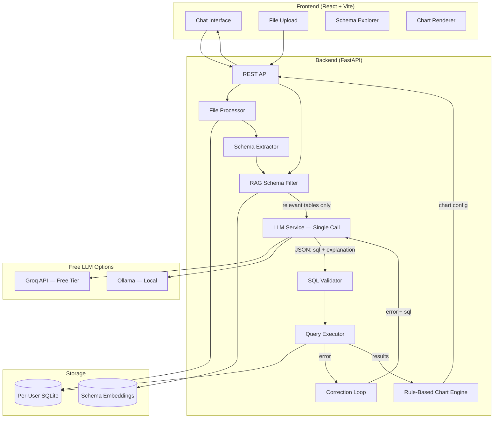
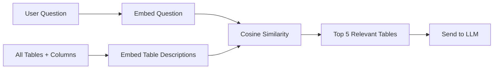
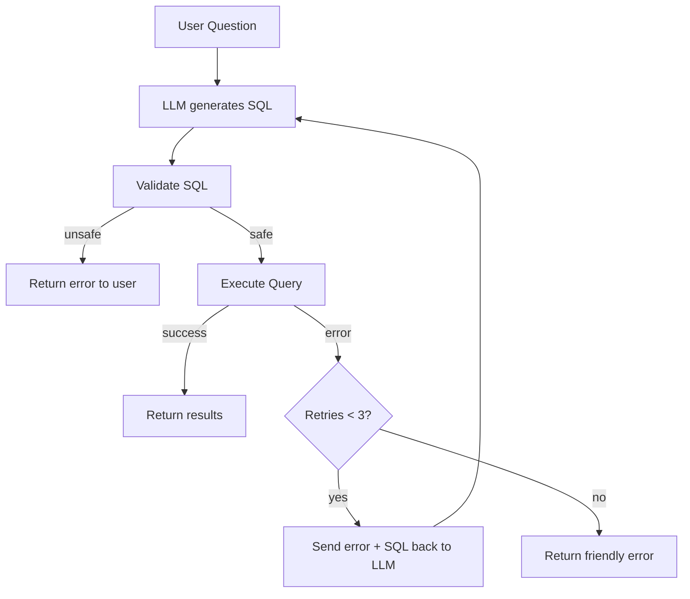

# Chat with Database (SQL + LLM) — Implementation Plan v2

> Revised based on feedback. All 5 issues addressed.

## Changes from v1

| Issue | v1 (Bad) | v2 (Fixed) |
|-------|----------|------------|
| LLM calls per question | 3 calls (SQL + explanation + chart) | **1 call** returning JSON |
| Schema handling | Full schema + sample data | **RAG filtering** — only relevant tables |
| Failed queries | Execute → fail → done | **Correction loop** — retry with error context |
| Chart type detection | LLM call | **Rule-based heuristics** |
| LLM provider | OpenAI (paid) | **Groq free tier + Ollama fallback** (free) |

---

## Architecture



---

## Free LLM Strategy

> [!IMPORTANT]
> **Zero cost. No paid API keys required.**

| Provider | Model | Cost | Speed | How |
|----------|-------|------|-------|-----|
| **Groq** (Primary) | `llama-3.3-70b-versatile` | Free tier (30 req/min) | ~500 tokens/sec | Free API key from [console.groq.com](https://console.groq.com) |
| **Ollama** (Fallback) | `llama3.2` or `mistral` | Completely free | Depends on hardware | Install Ollama, pull model |

- Groq free tier gives 30 requests/min and 6000 tokens/min — **more than enough** for this project
- Ollama runs 100% local — no internet needed, no limits
- System auto-detects which is available

---

## Key Design Fix #1: Single LLM Call

**One prompt → one JSON response:**

```
You are an expert SQL analyst. Given the database schema and user question,
return a JSON object with exactly these keys:

{
  "sql": "SELECT ...",
  "explanation": "This query finds ...",
  "assumptions": "Assumed 'revenue' means total sales"
}

Rules:
1. Generate ONLY SELECT statements.
2. Use only tables/columns from the provided schema.
3. Add LIMIT 100 unless user asks for all data.
4. The explanation should be 1-2 sentences for a non-technical user.
5. Return ONLY valid JSON, no markdown formatting.
```

**Result:** 1 API call instead of 3, ~3x faster, ~3x cheaper (free anyway).

---

## Key Design Fix #2: RAG Schema Filtering

**Problem:** Large database → 50+ tables → prompt too big → slow + inaccurate.

**Solution:** Use local embeddings to find relevant tables BEFORE sending to LLM.



- **Embedding model:** `all-MiniLM-L6-v2` via `sentence-transformers` (local, free, 80MB)
- **On file upload:** Embed each table as `"table_name: col1 (type), col2 (type), ..."`
- **On question:** Embed question → cosine similarity → top 5 tables → send only those to LLM
- **Fallback:** If ≤ 10 tables, skip RAG and send all (overhead not worth it)

---

## Key Design Fix #3: Query Correction Loop



Retry prompt:
```
The following SQL query failed with this error:
Query: {failed_sql}
Error: {error_message}

Please fix the query and return corrected JSON.
```

---

## Key Design Fix #4: Rule-Based Charts

No LLM needed. Simple heuristics:

```python
def detect_chart_type(columns, data):
    numeric_cols = [c for c in columns if is_numeric(data, c)]
    date_cols = [c for c in columns if is_date(data, c)]
    cat_cols = [c for c in columns if c not in numeric_cols + date_cols]

    if date_cols and numeric_cols:
        return "line"          # time series → line chart
    if cat_cols and numeric_cols:
        if len(data) <= 6:
            return "pie"       # few categories → pie
        return "bar"           # many categories → bar
    if len(numeric_cols) >= 2:
        return "scatter"       # two numerics → scatter
    return None                # no chart needed
```

**Result:** Instant chart type detection, zero API cost.

---

## Folder Structure

```
d:\project antigravity\
├── backend/
│   ├── app/
│   │   ├── __init__.py
│   │   ├── main.py                  # FastAPI entry point
│   │   ├── config.py                # Settings (Groq key, paths)
│   │   ├── models.py                # Pydantic request/response models
│   │   ├── routers/
│   │   │   ├── __init__.py
│   │   │   ├── upload.py            # POST /api/upload
│   │   │   ├── chat.py              # POST /api/chat
│   │   │   └── schema.py            # GET /api/schema/{session_id}
│   │   ├── services/
│   │   │   ├── __init__.py
│   │   │   ├── file_processor.py    # CSV/SQL → SQLite
│   │   │   ├── schema_extractor.py  # Extract tables/columns
│   │   │   ├── rag_filter.py        # Embedding-based schema filtering
│   │   │   ├── llm_service.py       # Groq/Ollama — single call
│   │   │   ├── sql_validator.py     # Multi-layer SQL safety
│   │   │   ├── query_executor.py    # Read-only execution + retry loop
│   │   │   └── chart_service.py     # Rule-based chart detection
│   │   └── utils/
│   │       ├── __init__.py
│   │       └── database.py          # SQLite connection manager
│   ├── data/                        # Per-user SQLite DBs
│   ├── uploads/                     # Temp file storage
│   ├── requirements.txt
│   ├── .env.example
│   └── .gitignore
├── frontend/
│   ├── index.html
│   ├── package.json
│   ├── vite.config.js
│   ├── src/
│   │   ├── main.jsx
│   │   ├── App.jsx
│   │   ├── index.css                # Premium dark theme
│   │   ├── components/
│   │   │   ├── ChatInterface.jsx    # Main chat area
│   │   │   ├── MessageBubble.jsx    # SQL + table + chart + explanation
│   │   │   ├── FileUpload.jsx       # Drag & drop upload
│   │   │   ├── SchemaViewer.jsx     # Table/column tree
│   │   │   ├── ResultTable.jsx      # Data table with sorting
│   │   │   ├── ChartDisplay.jsx     # Chart.js renderer
│   │   │   └── SqlDisplay.jsx       # Syntax highlighted SQL
│   │   └── api/
│   │       └── client.js            # Axios API client
│   └── .gitignore
└── README.md
```

---

## Proposed Changes (Detailed)

### Backend Services

#### [NEW] [llm_service.py](file:///d:/project%20antigravity/backend/app/services/llm_service.py)
- Abstract `LLMProvider` base class with `generate()` method
- `GroqProvider`: Uses Groq free API (`llama-3.3-70b-versatile`)
- `OllamaProvider`: Calls local Ollama server (`http://localhost:11434`)
- Auto-detection: try Groq first → fallback to Ollama
- **Single call** returning structured JSON (sql + explanation)
- Chat history window: last 5 messages for context

#### [NEW] [rag_filter.py](file:///d:/project%20antigravity/backend/app/services/rag_filter.py)
- On upload: generate embeddings for each table description
- Store embeddings as numpy arrays in memory (per session)
- On question: embed question → cosine similarity → return top-N tables
- Skip RAG if total tables ≤ 10

#### [NEW] [sql_validator.py](file:///d:/project%20antigravity/backend/app/services/sql_validator.py)
- Layer 1: Regex check for forbidden keywords
- Layer 2: `sqlparse` AST — only allow DML type `SELECT`
- Layer 3: Table name whitelist check against user's actual tables
- Layer 4: Semicolon check (no multi-statement injection)

#### [NEW] [query_executor.py](file:///d:/project%20antigravity/backend/app/services/query_executor.py)
- Read-only SQLite connection (`?mode=ro`)
- `PRAGMA query_only = ON`
- 5-second timeout
- **Correction loop:** on error → send error+SQL back to LLM → retry (max 3)
- Return results as list of dicts, capped at 1000 rows

#### [NEW] [chart_service.py](file:///d:/project%20antigravity/backend/app/services/chart_service.py)
- Pure Python heuristics — no LLM calls
- Detect column types from result data
- Return chart config JSON: `{ type, labels, datasets }`

### Frontend Components

#### [NEW] [ChatInterface.jsx](file:///d:/project%20antigravity/frontend/src/components/ChatInterface.jsx)
- Chat message list with auto-scroll
- Input with send button + keyboard shortcut (Enter)
- Loading skeleton animation during processing
- Message grouping: question → response (SQL + table + chart + explanation)

#### [NEW] [FileUpload.jsx](file:///d:/project%20antigravity/frontend/src/components/FileUpload.jsx)
- Drag-and-drop zone with visual feedback
- File type validation client-side
- Progress indicator
- Shows extracted schema on success

#### [NEW] [index.css](file:///d:/project%20antigravity/frontend/src/index.css)
- Dark theme: deep navy (#0a0e1a) background
- Glassmorphism panels with backdrop-blur
- Electric blue (#3b82f6) + purple (#8b5cf6) accent gradient
- Smooth micro-animations on hover/focus
- Google Font: Inter
- Custom scrollbars matching theme

---

## Dependencies

### Backend (`requirements.txt`)
```
fastapi==0.115.*
uvicorn==0.34.*
python-multipart==0.0.*
pandas==2.2.*
sqlparse==0.5.*
groq==0.13.*           # Groq Python SDK (free)
ollama==0.4.*           # Ollama Python SDK (free)
sentence-transformers==3.3.*  # Local embeddings (free)
scikit-learn==1.6.*     # cosine_similarity
pydantic-settings==2.7.*
```

### Frontend (`package.json`)
```
react, react-dom
chart.js, react-chartjs-2
highlight.js (SQL syntax highlighting)
axios
```

---

## Verification Plan

### Automated Tests
1. Start backend → verify all endpoints respond
2. Upload sample CSV → verify SQLite DB creation + schema extraction
3. Ask "show all data" → verify SQL generation + execution
4. Send `DROP TABLE` SQL → verify validator blocks it
5. Send broken SQL → verify correction loop fixes it
6. Check chart detection with different result shapes

### Browser Tests
1. Upload flow → drag file → see schema appear
2. Chat flow → type question → see SQL + table + chart + explanation
3. Multiple sessions → verify isolation (session A can't see session B data)

### Edge Cases
- Empty CSV upload
- CSV with special characters in headers
- Questions about non-existent tables
- Very large result sets (verify 1000 row cap)
